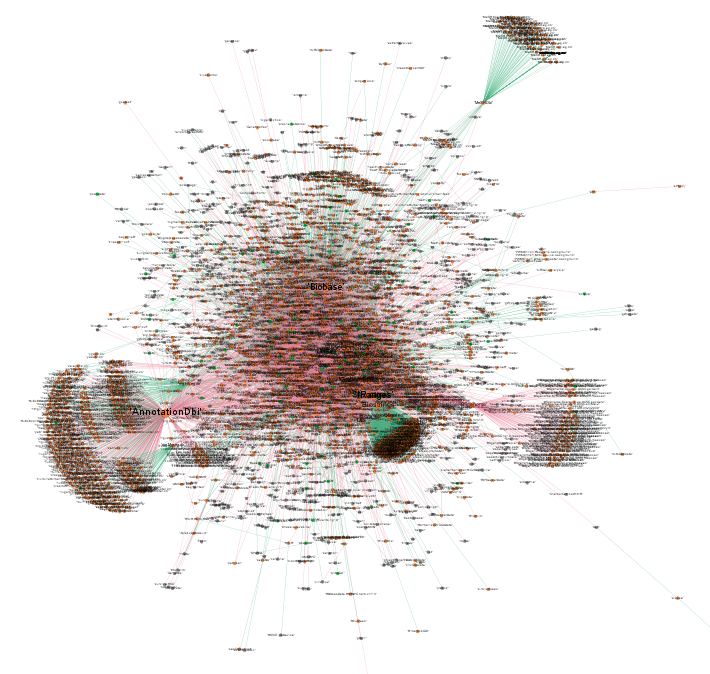
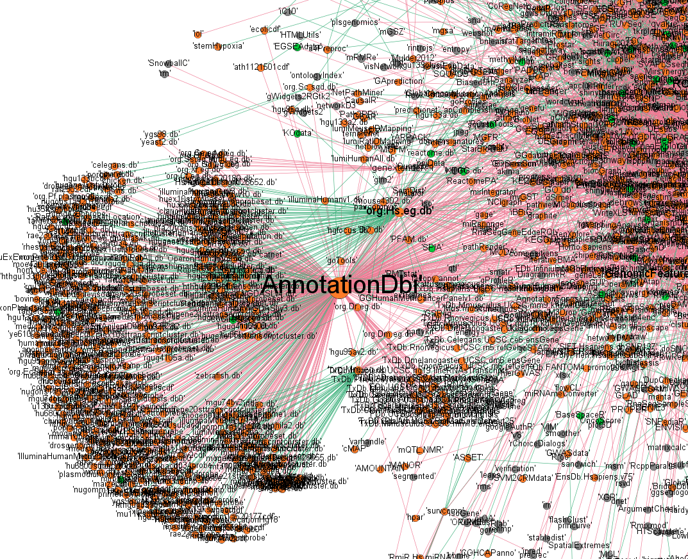
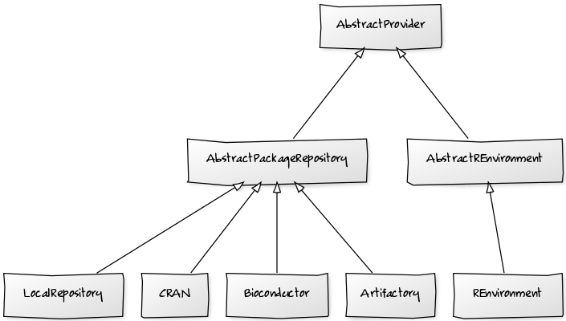

# RPackUtils

 

**Table of Contents**
* [Introduction](#introduction)
* [Requirements](#requirements)
* [Installation](#installation)
* [Configuration](#configuration)
* [Usage](#usage)
    * [rpackcc](#rpackcc)
    * [rpackbioc](#rpackbioc)
    * [rpackmran](#rpackmran)
    * [rpackq](#rpackq)
    * [rpacki](#rpacki)
    * [rpackc](#rpackc)
    * [rpackd](#rpackd)
    * [rpackm](#rpackm)
    * [rpackg](#rpackq)
    * [rpackscan](#rpackscan)
* [Repository types](#repository-types)
* [License checking](#license-checking)
* [Third parties](#third-parties)
* [License](#license)

## Introduction

R package dependencies manager and mirroring tool for *Bioconductor* and
*CRAN* written in Python.  With **RPackUtils** you can:
*  Install R packages in a reproducible manner with the control of packages
   versions and dependencies
*  Clone existing R environments
*  Mirror past and current *CRAN* snapshots published on *MRAN*
*  Mirror past and current *Bioconductor* versions
*  Use Artifactory as a R packages repository
*  Check and scan licenses of R packages

It is still under development.

## Requirements

**RPackUtils** needs Python3.

## Installation

1. Get the source code.
```bash
$ git clone https://github.com/pmpsa-hpc/RPackUtils.git
Cloning into 'RPackUtils'...
[...]
```

2. Enter the root folder and create a Virtualenv.
```bash
$ cd RPackUtils
$ python -m venv .
```

3. Activate the Virtualenv
```bash
$ . bin/activate
(RPackUtils) $
```

4. Upgrade pip and setuptools (recommended)
```bash
$ pip install -U pip
[...]

$ pip install -U setuptools
[...]
```

5. Build the Application
```bash
$ python setup.py build
[...]
```

6. Optionally launch the unit tests
```bash
(RPackUtils) $ cd tests
(RPackUtils) $ pytest -sv [-m "not slow"]
[...]
```
You can optionally unselect tests marked as "slow".

7. Install
```bash
(RPackUtils) $ python setup.py build install
[...]
```
This will install the binary commands in the *bin/* folder of your
Virtualenv.

You may want to specify an installation location with *--prefix*, please
check the documentation of the setup tool by typing :
```bash
(RPackUtils) $ python setup.py install --help
```

## Configuration

Customize the provided configuration file sample.

```bash
RPackUtils/tests/resources $ cp rpackutils.conf ~/
$ vim ~/rpackutils.conf
```

The configuration file has to be passed as an argument for commands requiring it:
```bash
$ RPACKCOMMAND --config ~/rpackutils.conf ...
```

In this configuration file, you have to define your available repositories.
**RPackUtils** currently supports the following repository types:
* JFrog Artifactory with the directive *artifactory_repos*
* Any R environment with *renvironment_repos*
* Any repository on your local file system, like a folder with *local_repos*

```
# [REPO_TYPE]_repos = [list of names]
#
# where each name links to an existing configuration section.
#
[repositories]
artifactory_repos = artifactory, artifactorydev
renvironment_repos = R-3.1.2, R-3.2.5
local_repos = local

[artifactory]
baseurl = https://YOUR_ARTIFACTORY_HOSTNAME/artifactory
user = YOUR_ARTIFACTORY_USER
password = "YOUR_ARTIFACTORY_PASSWORD"
verify = /toto/Certificate_Chain.pem
repos = R-3.1.2, Bioc-3.0, R-local, R-Data-0.1

[artifactorydev]
baseurl = https://YOUR_ARTIFACTORY_DEV_HOSTNAME/artifactory
user = YOUR_ARTIFACTORY_DEV_USER
password = "YOUR_ARTIFACTORY_DEV_PASSWORD"
verify = /toto/Certificate_Chain_Dev.pem
repos = R-3.1.2, Bioc-3.0, R-local, R-Data-0.1

[local]
baseurl = /home/john/RPackUtils/repository
repos = local1, local2

[R-3.1.2]
rhome = /home/john/opt/R-3.1.2
librarypath = lib64/R/library
licensecheck = True

[R-3.2.5]
rhome = /home/john/opt/R-3.2.5
librarypath = lib64/R/library
```

To know more about supported repository types, please read section
[Repository types](#repository-types).

In the *R-3.1.2* environment, we have enabled the *licensecheck*. This
feature is supported by any R environment and is disabled by default. For
more information about this feature, please refer to the dedicated section
[License checking](#license-checking).

To customize the temporary files location you have to change the
corresponding environment variable used by the *tempfile* Python
module. For bash shells, you have to change *TMPDIR*.

```bash
export TMPDIR=/home/john/tmp
```

## Usage

The entry points or commands are installed in *$PREFIX/bin*. This is either
inside your *bin/* folder of your Virtualenv or in the *bin/* folder of the
specified *--prefix*.

| Command                 | Purpose                                                                                              |
|-------------------------|------------------------------------------------------------------------------------------------------|
| [rpackcc](#rpackcc)     | Check the configuration File                                                                         |
| [rpackbioc](#rpackbioc) | Query the Bioconductor repository for available releases                                             |
| [rpackmran](#rpackmran) | Query the MRAN repository for available snapshots                                                    |
| [rpackq](#rpackq)       | Search accross repositories for a package or a list of packages                                      |
| [rpacki](#rpacki)       | Install R packages with resolved dependencies                                                        |
| [rpackd](#rpackd)       | Download R packages and resolved dependencies (dry-run install)                                      |
| [rpackc](#rpackc)       | Install R packages based on an existing environments (clone)                                         |
| [rpackm](#rpackm)       | Download R packages from a specified repository (CRAN, Bioc or Local) and upload them to Artifactory (mirror) |
| [rpackg](#rpackg)       | Generate a dependencies graph                                                                        |
| [rpackscan](#rpackscan) | Scan a repository or an R environment                                                                |

The following sections provide use cases for each command.

### rpackcc

The goal of this command is to parse the configuration file and validate
it. **RPackUtils** will try to connect to any defined remote repository
and check any local file system path exist.

```bash
$ rpackcc -h
usage: rpackcc [-h] --config CONFIG

Check the configuration file and report issues if any

optional arguments:
  -h, --help       show this help message and exit
  --config CONFIG  RPackUtils configuration file
```

Example with a connection issue:
```bash
$ rpackcc --config ~/rpackutils.conf
Checking the configuration file...
Building Artifactory instance "artifactory"
Checking connection to https://artifactory.local/artifactory ...
FATAL: Cannot connect to https://artifactory.local/artifactory: Could not find a suitable TLS CA certificate bundle, invalid path: /toto/Certificate_Chain.pem
(...)
```

Example of a successful validation:
```bash
$ rpackcc --config ~/rpackutils.conf
Building Artifactory instance "myartifactory"
Checking connection to https://myartifactory/artifactory ...
Connection to https://myartifactory/artifactory established.
Building R environment instance "R-3.1.2"
Building R environment instance "R-3.2.2"
Building R environment instance "R-3.2.5"
Building R environment instance "R-3.2.5_1"
Building R environment instance "R-3.2.5_2"
Building Local repository instance "local1"
Building Local repository instance "local2"
Time elapsed: 0.870 seconds.
```

### rpackbioc

Get all available **Bioconductor** releases from their website.

```bash
$ rpackbioc -h
usage: rpackbioc [-h]

Query the Bioconductor repository for available releases

optional arguments:
  -h, --help  show this help message and exit
```

Providing no argument will list all available releases.

```bash
$ rpackbioc
Checking connection to https://www.bioconductor.org ...
Connection to https://www.bioconductor.org established.
Bioconductor 3.7 (devel)
Bioconductor 3.6 (release)
Bioconductor 3.5
Bioconductor 3.4
Bioconductor 3.3
Bioconductor 3.2
Bioconductor 3.1
Bioconductor 3.0
[...]
```

### rpackmran

```bash
$ rpackmran -h
usage: rpackmran [-h] [--Rversion RVERSION] [--procs PROCS]
                 [--dump DUMPFILEPATH] [--restore RESTOREFROMFILEPATH]

Search accross repositories for a package or a list of packages

optional arguments:
  -h, --help            show this help message and exit
  --Rversion RVERSION   The version of R, as "x.y.z" (ignored when --restore
                        is used)
  --procs PROCS         Number of parallel processes used to parse snapshots
                        properties, default=50
  --dump DUMPFILEPATH   a file where to dump the results
  --restore RESTOREFROMFILEPATH
                        a file where to read the results from
```

Providing no argument will fetch all available snapshots for all archived R
versions.

```bash
$ rpackmran 
I will use 50 parallel processes to parse the R version from snapshots dates.
Fetching available MRAN snapshots from the Internet...
Checking connection to https://mran.revolutionanalytics.com ...
Connection to https://mran.revolutionanalytics.com established.
1225 snapshot dates found.
Snapshots processed/matching the specified R version (1225), skipped (0), errors (0).
Time elapsed: 19 seconds.
============================================================
R version 3.3.2, 125 snapshots
----------------------------------------
2016-11-01 2016-11-02 2016-11-03 2016-11-04 2016-11-05 2016-11-06 2016-11-07 2016-11-08 2016-11-09 2016-11-10 2016-11-11 2016-11-12 2016-11-13 2016-11-14 2016-11-15 2016-11-16 2016-11-17 2016-11-18 2016-11-19 2016-11-20 2016-11-21 2016-11-22 2016-11-23 2016-11-24 2016-11-25 2016-11-26 2016-11-27 2016-11-28 2016-11-29 2016-11-30 2016-12-01 2016-12-02 2016-12-03 2016-12-05 2016-12-06 2016-12-07 2016-12-08 2016-12-09 2016-12-10 2016-12-11 2016-12-12 2016-12-13 2016-12-14 2016-12-15 2016-12-16 2016-12-17 2016-12-18 2016-12-19 2016-12-20 2016-12-21 2016-12-22 2016-12-23 2016-12-24 2016-12-25 2016-12-26 2016-12-27 2016-12-28 2016-12-29 2016-12-30 2016-12-31 2017-01-01 2017-01-02 2017-01-03 2017-01-04 2017-01-05 2017-01-06 2017-01-07 2017-01-08 2017-01-09 2017-01-10 2017-01-11 2017-01-12 2017-01-13 2017-01-14 2017-01-15 2017-01-16 2017-01-17 2017-01-18 2017-01-19 2017-01-20 2017-01-21 2017-01-22 2017-01-23 2017-01-24 2017-01-25 2017-01-26 2017-01-27 2017-01-28 2017-01-29 2017-01-30 2017-01-31 2017-02-01 2017-02-02 2017-02-03 2017-02-04 2017-02-05 2017-02-06 2017-02-07 2017-02-08 2017-02-09 2017-02-10 2017-02-11 2017-02-12 2017-02-13 2017-02-14 2017-02-15 2017-02-16 2017-02-17 2017-02-18 2017-02-19 2017-02-20 2017-02-21 2017-02-22 2017-02-23 2017-02-24 2017-02-25 2017-02-26 2017-02-27 2017-02-28 2017-03-01 2017-03-02 2017-03-03 2017-03-04 2017-03-05 2017-03-06

R version 3.1.3, 38 snapshots
----------------------------------------
2015-03-10 2015-03-11 2015-03-12 2015-03-13 2015-03-14 2015-03-15 2015-03-16 2015-03-17 2015-03-18 2015-03-19 2015-03-20 2015-03-21 2015-03-22 2015-03-23 2015-03-24 2015-03-25 2015-03-26 2015-03-27 2015-03-28 2015-03-29 2015-03-30 2015-03-31 2015-04-01 2015-04-02 2015-04-03 2015-04-04 2015-04-05 2015-04-06 2015-04-07 2015-04-08 2015-04-09 2015-04-10 2015-04-11 2015-04-12 2015-04-13 2015-04-14 2015-04-15 2015-04-16

[...]
```

Usually, you are just interested with a particular R version.
For this, use the *--Rversion* argument.

```bash
$ rpackmran --Rversion="3.3.2"
I will use 50 parallel processes to parse the R version from snapshots dates.
Fetching available MRAN snapshots from the Internet...
Checking connection to https://mran.revolutionanalytics.com ...
Connection to https://mran.revolutionanalytics.com established.
1225 snapshot dates found.
Snapshots processed/matching the specified R version (125), skipped (1100), errors (0).
Time elapsed: 20 seconds.
============================================================
R version 3.3.2, 125 snapshots
----------------------------------------
2016-11-01 2016-11-02 2016-11-03 2016-11-04 2016-11-05 2016-11-06 2016-11-07 2016-11-08 2016-11-09 2016-11-10 2016-11-11 2016-11-12 2016-11-13 2016-11-14 2016-11-15 2016-11-16 2016-11-17 2016-11-18 2016-11-19 2016-11-20 2016-11-21 2016-11-22 2016-11-23 2016-11-24 2016-11-25 2016-11-26 2016-11-27 2016-11-28 2016-11-29 2016-11-30 2016-12-01 2016-12-02 2016-12-03 2016-12-05 2016-12-06 2016-12-07 2016-12-08 2016-12-09 2016-12-10 2016-12-11 2016-12-12 2016-12-13 2016-12-14 2016-12-15 2016-12-16 2016-12-17 2016-12-18 2016-12-19 2016-12-20 2016-12-21 2016-12-22 2016-12-23 2016-12-24 2016-12-25 2016-12-26 2016-12-27 2016-12-28 2016-12-29 2016-12-30 2016-12-31 2017-01-01 2017-01-02 2017-01-03 2017-01-04 2017-01-05 2017-01-06 2017-01-07 2017-01-08 2017-01-09 2017-01-10 2017-01-11 2017-01-12 2017-01-13 2017-01-14 2017-01-15 2017-01-16 2017-01-17 2017-01-18 2017-01-19 2017-01-20 2017-01-21 2017-01-22 2017-01-23 2017-01-24 2017-01-25 2017-01-26 2017-01-27 2017-01-28 2017-01-29 2017-01-30 2017-01-31 2017-02-01 2017-02-02 2017-02-03 2017-02-04 2017-02-05 2017-02-06 2017-02-07 2017-02-08 2017-02-09 2017-02-10 2017-02-11 2017-02-12 2017-02-13 2017-02-14 2017-02-15 2017-02-16 2017-02-17 2017-02-18 2017-02-19 2017-02-20 2017-02-21 2017-02-22 2017-02-23 2017-02-24 2017-02-25 2017-02-26 2017-02-27 2017-02-28 2017-03-01 2017-03-02 2017-03-03 2017-03-04 2017-03-05 2017-03-06

============================================================
```

You have the possibility to store any result as a JSON formatted file with
the *--dump* argument.  The opposite *--restore* argument will read the
file instead of querying the **MRAN** website.

### rpackq

```bash
$ rpackq -h
usage: rpackq [-h] [--repos REPOS] --packages PACKAGES --config CONFIG

Search accross repositories for a package or a list of packages

optional arguments:
  -h, --help           show this help message and exit
  --repos REPOS        Comma separated repository names, by default: all
                       defined in the configuration file
  --packages PACKAGES  Comma separated package names to search
  --config CONFIG      RPackUtils configuration file
```

Search for the package *tmod* in Artifactory. This assumes
*artifactory-pmi* is defined in the configuration file ~/rpackutils.conf

```bash
$ rpackq --config="~/rpackutils.conf" \
         --repos="artifactory-pmi" \
         --packages="tmod"

Building Artifactory instance "artifactory-pmi"
Checking connection to https://myartifactory/artifactory ...
Connection to https://myartifactory/artifactory established.
-------------------------------------
Searching for tmod in artifactory-pmi...
-
Repository instance "artifactory-pmi"
1 matche(s) found
-
Downloading R package: tmod_0.30.tar.gz
Done downloading R package: tmod_0.30.tar.gz
Package: tmod Version: 0.30 License: GPL (>= 2.0) 
Repository path: R-3.1.2/tmod_0.30.tar.gz
Depends: R
Imports: beeswarm,tagcloud,XML,methods,plotwidgets
LinkingTo: 
Suggests: testthat,knitr,rmarkdown,pca3d,limma
-------------------------------------
```

### rpacki

The standard way to install R packages is to invoke the command "R CMD
INSTALL package" or its equivalent on the R prompt.

When you try to install a package having dependencies not yet installed on
the target environment, you run into this error:

```bash
$ R CMD INSTALL someAwesomePackage_2.0.26.tar.gz
* installing to library ‘/foo/bar/R-3.1.2/lib64/R/library’
ERROR: dependency ‘foodep’ is not available for package ‘someAwesomePackage’
* removing ‘/foo/bar/R-3.1.2/lib64/R/library/someAwesomePackage’
```

Then, you'll try to install the dependency and, as before, you may
experience the error about missing dependencies.  It is an annoying and
time consuming process of trail and error.

Use *rapcki* for the installation, it will resolve all dependencies for
you!

```bash
$ rpacki -h
usage: rpacki [-h] [--repo REPONAME] [--Renv RENVNAME] --packages PACKAGES
              [--overwrite] [--overwrite-specified] --config CONFIG

Install packages to a target R environment

optional arguments:
  -h, --help            show this help message and exit
  --repo REPONAME       The repository name where to get packages (it must be
                        defined in the configuration file)
  --Renv RENVNAME       Name of the target R environment where to do the
                        installation (the name must be defined in the
                        configuration file)
  --packages PACKAGES   Comma separated package names to install
  --overwrite           Overwrite already installed packages. By default,
                        nothing gets overwritten.
  --overwrite-specified
                        Overwrite only specified packages (in --packages) that
                        are already installed. By default, nothing gets
                        overwritten.
  --config CONFIG       RPackUtils configuration file
```

Install the *tmod* package. For this example we decide to overwrite any
already installed package with the *--overwrite* argument.

```bash
$ rpacki --config ~/rpackutils.conf \
         --repo myartifactory \
         --Renv R-3.2.2 \
         --packages tmod \
         --overwrite

Building Artifactory instance "myartifactory"
Checking connection to https://myartifactory/artifactory ...
Connection to https://myartifactory/artifactory established.
Building R environment instance "R-3.2.2"
Using the target R environment: R-3.2.2 at /home/john/opt/R-3.2.2
Using the package repository: myartifactory at https://myartifactory/artifactory with folders: R-3.2.2
Downloading R package: tmod_0.19.tar.gz
Done downloading R package: tmod_0.19.tar.gz
Downloaded R-3.2.2/tmod_0.19.tar.gz
Downloading R package: tmod_0.30.tar.gz
Done downloading R package: tmod_0.30.tar.gz
Downloaded R-3.2.2/tmod_0.30.tar.gz
Downloading R package: beeswarm_0.2.1.tar.gz
Done downloading R package: beeswarm_0.2.1.tar.gz
Processing node: beeswarm...
The package is already installed
Uninstalling the previous version
Installing package
The license "Artistic-2.0" is RESTRICTED
Running: /home/john/opt/R-3.2.2/bin/R CMD INSTALL /home/john/tmpR/tmp3cp2dt42/beeswarm_0.2.1.tar.gz
Waiting for PID 32508 to complete...
Installation of package beeswarm_0.2.1.tar.gz DONE.
Downloading R package: pca3d_0.8.tar.gz
Done downloading R package: pca3d_0.8.tar.gz
Downloading R package: rgl_0.95.1367.tar.gz
Done downloading R package: rgl_0.95.1367.tar.gz
Processing node: rgl...
The package is already installed
Uninstalling the previous version
Installing package
The license "GPL" is RESTRICTED
Running: /home/john/opt/R-3.2.2/bin/R CMD INSTALL /home/john/tmpR/tmpphaz7_oy/rgl_0.95.1367.tar.gz
Waiting for PID 32531 to complete...
Installation of package rgl_0.95.1367.tar.gz DONE.
Downloading R package: ellipse_0.3-8.tar.gz
Done downloading R package: ellipse_0.3-8.tar.gz
Processing node: ellipse...
The package is already installed
Uninstalling the previous version
Installing package
The license "GPL (>= 2)" is RESTRICTED
Running: /home/john/opt/R-3.2.2/bin/R CMD INSTALL /home/john/tmpR/tmpc1jkb9uz/ellipse_0.3-8.tar.gz
Waiting for PID 897 to complete...
Installation of package ellipse_0.3-8.tar.gz DONE.
Processing node: pca3d...
The package is already installed
Uninstalling the previous version
Installing package
The license "GPL-2" is RESTRICTED
Running: /home/john/opt/R-3.2.2/bin/R CMD INSTALL /home/john/tmpR/tmpfi4vkydr/pca3d_0.8.tar.gz
Waiting for PID 914 to complete...
Installation of package pca3d_0.8.tar.gz DONE.
Downloading R package: tagcloud_0.6.tar.gz
Done downloading R package: tagcloud_0.6.tar.gz
Downloading R package: RColorBrewer_1.1-2.tar.gz
Done downloading R package: RColorBrewer_1.1-2.tar.gz
Processing node: RColorBrewer...
The package is already installed
Uninstalling the previous version
Installing package
Running: /home/john/opt/R-3.2.2/bin/R CMD INSTALL /home/john/tmpR/tmplm9m5aim/RColorBrewer_1.1-2.tar.gz
Waiting for PID 927 to complete...
Installation of package RColorBrewer_1.1-2.tar.gz DONE.
Downloading R package: Rcpp_0.12.1.tar.gz
Done downloading R package: Rcpp_0.12.1.tar.gz
Downloaded R-3.2.2/Rcpp_0.12.1.tar.gz
Downloading R package: Rcpp_0.12.15.tar.gz
Done downloading R package: Rcpp_0.12.15.tar.gz
Downloaded R-3.2.2/Rcpp_0.12.15.tar.gz
Downloading R package: Rcpp_0.12.6.tar.gz
Done downloading R package: Rcpp_0.12.6.tar.gz
Downloaded R-3.2.2/Rcpp_0.12.6.tar.gz
Downloading R package: Rcpp_0.12.7.tar.gz
Done downloading R package: Rcpp_0.12.7.tar.gz
Downloaded R-3.2.2/Rcpp_0.12.7.tar.gz
Processing node: Rcpp...
The package is already installed
Uninstalling the previous version
Installing package
The license "GPL (>= 2)" is RESTRICTED
Running: /home/john/opt/R-3.2.2/bin/R CMD INSTALL /home/john/tmpR/tmpj9y6gn27/Rcpp_0.12.15.tar.gz
Waiting for PID 944 to complete...
Installation of package Rcpp_0.12.15.tar.gz DONE.
Processing node: tagcloud...
The package is already installed
Uninstalling the previous version
Installing package
The license "GPL (>= 2)" is RESTRICTED
Running: /home/john/opt/R-3.2.2/bin/R CMD INSTALL /home/john/tmpR/tmpoe2xszyf/tagcloud_0.6.tar.gz
Waiting for PID 993 to complete...
Installation of package tagcloud_0.6.tar.gz DONE.
Downloading R package: XML_3.98-1.3.tar.gz
Done downloading R package: XML_3.98-1.3.tar.gz
Processing node: XML...
The package is already installed
Uninstalling the previous version
Installing package
Running: /home/john/opt/R-3.2.2/bin/R CMD INSTALL /home/john/tmpR/tmpczqglppx/XML_3.98-1.3.tar.gz
Waiting for PID 1049 to complete...
Installation of package XML_3.98-1.3.tar.gz DONE.
Processing node: tmod...
The package is already installed
Uninstalling the previous version
Installing package
The license "GPL (>= 2.0)" is RESTRICTED
Running: /home/john/opt/R-3.2.2/bin/R CMD INSTALL /home/john/tmpR/tmpz9qgokgb/tmod_0.30.tar.gz
Waiting for PID 2094 to complete...
Installation of package tmod_0.30.tar.gz DONE.
Time elapsed: 87.387 seconds.
```


### rpackc

*rpackc* clones a R environment to another, where both R environments do
not have to be of the same version. The target environment or the "clone"
will have the same set of packages installed as the input or source R
environment.

```bash
$ rpackc -h
usage: rpackc [-h] [--repo REPONAME] [--Renvin RENVNAMEINPUT]
              [--Renvout RENVNAMEOUTPUT] [--overwrite] --config CONFIG

Install R packages based on an existing environments (clone)

optional arguments:
  -h, --help            show this help message and exit
  --repo REPONAME       The repository name where to get packages (it must be
                        defined in the configuration file)
  --Renvin RENVNAMEINPUT
                        Name of the input R environment (the name must be
                        defined in the configuration file)
  --Renvout RENVNAMEOUTPUT
                        Name of the target R environment where to do the
                        installation (the name must be defined in the
                        configuration file)
  --overwrite           Overwrite already installed packages. By default,
                        nothing gets overwritten.
  --config CONFIG       RPackUtils configuration file
```

Let's clone R-3.2.5_ref to R-3.2.5.

* Input R environment: R-3.2.5_ref
* Output R environment (clone): R-3.2.5

Both R environments must be defined in the configuration file. Here is an
excample.

```bash
[repositories]
artifactory_repos = myartifactory
renvironment_repos = R-3.2.5, R-3.2.5_ref

[myartifactory]
(...)

[R-3.2.5]
rhome = /home/john/opt/R-3.2.5
librarypath = lib64/R/library
licensecheck = True

[R-3.2.5_ref]
rhome = /home/john/opt/R-3.2.5_ref
librarypath = lib64/R/library

```

The command specifies both R environments and *myartifactory* as the
package repository.

```bash
rpackc --config ~/rpackutils_pmi.conf \
       --repo myartifactory \
       --Renvin R-3.2.5_ref \
       --Renvout R-3.2.5
```


### rpackd

*rpacki* is used to install packages. *rpackd* is similar but does not
actually install anything: it performs dry-run installations, it's kind of
a simulating mode of *rpacki*.

*rpacki* will generate a bash script *install.sh* and store all downloaded
R packages in a destination folder specified by the argument *--dest*.

```bash
$ rpackd -h
usage: rpackd [-h] [--repo REPONAME] [--Renv RENVNAME] --packages PACKAGES
              --dest DEST [--overwrite] --config CONFIG

Install packages to a target R environment in dry-run mode

optional arguments:
  -h, --help           show this help message and exit
  --repo REPONAME      The repository name where to get packages (it must be
                       defined in the configuration file)
  --Renv RENVNAME      Name of the target R environment where to do the
                       installation (the name must be defined in the
                       configuration file)
  --packages PACKAGES  Comma separated package names to install
  --dest DEST          Path where to store downloaded packages and the
                       installation script. It must exist.
  --overwrite          Overwrite already installed packages. By default,
                       nothing gets overwritten.
  --config CONFIG      RPackUtils configuration file
```

Please consider the following example.

```bash
$ rpackd --config ~/rpackutils.conf \
         --repo myartifactory \
         --Renv R-3.2.5 \
         --packages ggplot2 \
         --overwrite \
         --dest ~/dest
```

The destination folder will contain the installation script *install.sh*
along with the necesary R packages tarballs.

```bash
$ ls ~/dest
colorspace_1.2-6.tar.gz  install.sh             plyr_1.8.3.tar.gz          scales_0.4.1.tar.gz
dichromat_2.0-0.tar.gz   labeling_0.3.tar.gz    RColorBrewer_1.1-2.tar.gz  stringi_1.1.6.tar.gz
digest_0.6.12.tar.gz     lazyeval_0.2.0.tar.gz  Rcpp_0.12.15.tar.gz        stringr_1.2.0.tar.gz
ggplot2_2.2.1.tar.gz     magrittr_1.5.tar.gz    reshape2_1.4.1.tar.gz      tibble_1.3.4.tar.gz
gtable_0.2.0.tar.gz      munsell_0.4.3.tar.gz   rlang_0.1.2.tar.gz
```

The installation script contain all necessary commands to install the
packages in the correct order: the dependencies first.

```bash
$ cat ~/dest/install.sh 
~/opt/R-3.2.5/bin/R CMD INSTALL ~/dest/digest_0.6.12.tar.gz
~/opt/R-3.2.5/bin/R CMD INSTALL ~/dest/gtable_0.2.0.tar.gz
~/opt/R-3.2.5/bin/R CMD INSTALL ~/dest/Rcpp_0.12.15.tar.gz
~/opt/R-3.2.5/bin/R CMD INSTALL ~/dest/plyr_1.8.3.tar.gz
~/opt/R-3.2.5/bin/R CMD INSTALL ~/dest/stringi_1.1.6.tar.gz
~/opt/R-3.2.5/bin/R CMD INSTALL ~/dest/magrittr_1.5.tar.gz
~/opt/R-3.2.5/bin/R CMD INSTALL ~/dest/stringr_1.2.0.tar.gz
~/opt/R-3.2.5/bin/R CMD INSTALL ~/dest/reshape2_1.4.1.tar.gz
~/opt/R-3.2.5/bin/R CMD INSTALL ~/dest/RColorBrewer_1.1-2.tar.gz
~/opt/R-3.2.5/bin/R CMD INSTALL ~/dest/dichromat_2.0-0.tar.gz
~/opt/R-3.2.5/bin/R CMD INSTALL ~/dest/colorspace_1.2-6.tar.gz
~/opt/R-3.2.5/bin/R CMD INSTALL ~/dest/munsell_0.4.3.tar.gz
~/opt/R-3.2.5/bin/R CMD INSTALL ~/dest/labeling_0.3.tar.gz
~/opt/R-3.2.5/bin/R CMD INSTALL ~/dest/scales_0.4.1.tar.gz
~/opt/R-3.2.5/bin/R CMD INSTALL ~/dest/rlang_0.1.2.tar.gz
~/opt/R-3.2.5/bin/R CMD INSTALL ~/dest/tibble_1.3.4.tar.gz
~/opt/R-3.2.5/bin/R CMD INSTALL ~/dest/lazyeval_0.2.0.tar.gz
~/opt/R-3.2.5/bin/R CMD INSTALL ~/dest/ggplot2_2.2.1.tar.gz
```


### rpackm

Mirror a particular snapshot of CRAN or a Bioconductor release.

```bash
$ rpackm -h
usage: rpackm [-h] [--input-repository INPUTREPO]
              [--inputrepoparam INPUTREPOPARAM] [--biocview BIOCVIEW]
              --output-repository OUTPUTREPO --output-repository-folder
              OUTPUTREPOFOLDER [--dest DEST] [--keep] [--procs PROCS] --config
              CONFIG

Download R packages from a specified repository (CRAN or Bioconductor) and
upload them to Artifactory (mirror)

optional arguments:
  -h, --help            show this help message and exit
  --input-repository INPUTREPO
                        The type of public R repository to mirror, possible
                        values: "cran", "bioc" or the name of a Local
                        repository
  --inputrepoparam INPUTREPOPARAM
                        The release of Bioconductor or the snapshot date of
                        CRAN
  --biocview BIOCVIEW   When mirroring Bioconductor only: specify the view:
                        "software", "experimentData", "annotationData" or by
                        default: "all"
  --output-repository OUTPUTREPO
                        The destination Artifactory instance name
  --output-repository-folder OUTPUTREPOFOLDER
                        The destination Artifactory repository folder name
  --dest DEST           Path where to store downloaded packages. It must
                        exist. A temp folder will be used otherwise.
  --keep                Keep downloaded files
  --procs PROCS         Number of parallel downloads and uploads, default=10
  --config CONFIG       RPackUtils configuration file
```

To mirror CRAN, you need to provide a snapshot date. You can get a list of
valid tags with the *rpackmran* command.

In the following example, we want to mirror the CRAN snapshot *2016-05-03*.
The mirror will be stored inside the *myartifactory* instance in the
repository or folder names *CRAN_1026-05-03*.

```bash
rpackm --input-repository cran --inputrepoparam 2016-05-03 \
       --output-repository myartifactory \
       --output-repository-folder CRAN_2016-05-03 \
       --config ~/rpackutils.conf \
       --dest ~/CRAN_2016-05-03
       --keep
```

The command is similar for Bioconductor and instead of specifying a
snapshot date, you have to specify the release you want to mirror. You can
get a list of available releases by running the command *rpackbioc*.

```bash
rpackm --input-repository bioc --inputrepoparam 3.8 \
       --output-repository myartifactory \
       --output-repository-folder Bioc-3.8 \
       --config ~/rpackutils.conf \
       --dest ~/Bioc-3.8
       --keep
```

If the process fails to download a package after 3 retries, which may
happen while mirroring CRAN, the downloaded packages will be in the
temporary folder or in the folder specified by *--dest* thanks to the
*--keep* switch.  The command can be launched again, so it is recommended
to specify *--keep*, since the folder can be reused for any subsequent run
of the process.

Additionally, it may be helpful to run one *rpackm* command per
Bioconductor view with the *--biocview* parameter in case of any connection
issue.

```bash
rpackm --input-repository bioc --inputrepoparam 3.8 \
       --output-repository myartifactory \
       --output-repository-folder Bioc-3.8 \
       --config ~/rpackutils.conf \
       --dest ~/Bioc-3.8 --biocview software --keep
[...]
rpackm --input-repository bioc --inputrepoparam 3.8 \
       --output-repository myartifactory \
       --output-repository-folder Bioc-3.8 \
       --config ~/rpackutils.conf \
       --dest ~/Bioc-3.8 --biocview experimentData --keep
[...]
rpackm --input-repository bioc --inputrepoparam 3.8 \
       --output-repository myartifactory \
       --output-repository-folder Bioc-3.8 \
       --config ~/rpackutils.conf \
       --dest ~/Bioc-3.8 --biocview annotationData --keep
[...]
```

A local repository can also be specified instead of the remote *cran* or
*bioc* repositories. Please consider the following example:

```bash
rpackm --input-repository Downloads --output-repository myartifactory \
       --output-repository-folder CRAN_2016-05-03 \
       --config ~/rpackutils.conf
```

The local repository *Downloads* has to be defined in the configuration
file.

```bash
local_repos = Downloads

[Downloads]
baseurl = /home/john/Downloads
repos = RPackUtils
```


### rpackg

You can generate dependency graphs directly from **CRAN**, **Bioconductor** or any
supported repository type defined in the configuration file.

```bash
$ rpackg -h
usage: rpackg [-h] --repo REPO [--repoparam REPOPARAM] [--packages PACKAGES]
              [--traverse TRAVERSE] [--config CONFIG] --out OUT

Generate a dependencies graph

optional arguments:
  -h, --help            show this help message and exit
  --repo REPO           The repository to work with. Identified by its name in
                        the configuration file. Use "cran" or "bioc" to use
                        CRAN or Bioconductor respectively
  --repoparam REPOPARAM
                        Additional repository parameter. For Artifactory:
                        "repo name"; all defined repositories will be used
                        otherwise. Bioconductor: "release numer, view" where
                        "view" can be 1 of "software", "experimentData",
                        "annotationData". CRAN: "snapshot date".
  --packages PACKAGES   Comma separated list of root packages to create the
                        graph, by default all will be included
  --traverse TRAVERSE   By default "imports,depends,linkingto", to traverse
                        all required packages to build the dependency
                        graph. "suggests" is ignored by default.
  --config CONFIG       RPackUtils configuration file, required unless you use
                        CRAN or Bioconductor as repository
  --out OUT             Output file where to write the GML
```

The *--packages* parameter is optional: you can choose to focus on one or
more particular packages if you like. All available packages in the
repository will be taken into account otherwise.

You can choose the list of fields from ['imports', 'depends',
'linkingto', 'suggests'] to take into account while building the
dependency graph. By default, 'imports', 'depends' and 'linkingto' are
used.

Here is an example to compute the dependency graph for all vailable R
packages from the *2016-05-03* snapshot. This snapshot contains more than
8k packages.

```bash
rpackg --repo cran --repoparam 2016-05-03 \
       --out ~/RPackUtils_cran_2016-05-03.gml
```

Here are renderings of the dependency graph of the Bioconductor repository
with the help of Gephi (*citation* [here](#third-parties)).





The gml file has the following attributes for each node:

| Attribute             | Description                                  |
|-----------------------|----------------------------------------------|
| label                 | package name                                 |
| name                  | package name                                 |
| version               | package version                              |
| depends               | packages in depends                          |
| imports               | packages in imports                          |
| linkingto             | packages in linkingto                        |
| suggests              | packages in suggests                         |
| license               | package license                              |
| licenseclass          | ALLOWED / RESTRICETD / BLACKLISTED / UNKNOWN |
| installationisallowed | 1 / 0                                        |
| installationwarning   | 1 / 0                                        |

Technically, the node's attributes corresponds to an instance of the
PackInfo class.


### rpackscan

Scan all R packages to fetch their metadata from the DESCRIPTION file from
one or more specified repository/repositories.

```bash
$ rpackscan -h
usage: rpackscan [-h] --repos REPOS --config CONFIG --out OUT

Scan a repository or an R environment

optional arguments:
  -h, --help       show this help message and exit
  --repos REPOS    Comma separated repository names, use "all": to specify all
                   defined in the configuration file
  --config CONFIG  RPackUtils configuration file
  --out OUT        Output file where to write the CSV
```

Please consider the following example to scan an existing R environment:

```bash
$ rpackscan --repos R-3.2.5 --config rpackutils.conf --out R325.csv

[...]
-------------------------------------
Writting output CSV file to "R325.csv" ...
Time elapsed: 22.923 seconds.
```

The output file, is a comma-separated format (CSV) and as a table, it looks
like the following:

| Name     | Version | License            | License class | Depends | Imports         | LinkingTo | Suggests                 | Installation allowed | Installation warning |
|----------|---------|--------------------|---------------|---------|-----------------|-----------|--------------------------|----------------------|----------------------|
| evaluate | 0.9     | MIT + file LICENSE | UNKNOWN       | R       | methods,stringr |           | testthat,lattice,ggplot2 | True                 | True                 |
| [...]    |         |                    |               |         |                 |           |                          |                      |                      |


## Repository types

The following class diagram shows the hierarchy of the repository types. We
distinguish 2 main types:

* *AbstractPackageRepository*
* *AbstractREnvironment*

The *AbstractPackageRepository* represents a folder location (file or URL)
holding R packages, and the *AbstractREnvironment*, a folder (file) where a
R environment is installed.

*AbstractPackageRepository* is the super type of the following:

* *LocalRepository*, a local folder holding R packages
* *CRAN*, the MRAN archive on the web
* *Bioconductor*, the Bioconductor website
* *Artifactory*, a JFrog repository manager




## License checking

**RPackUtils** divides package licenses into 4 classes:
* BLACKLISTED
* RESTRICTED
* ALLOWED
* UNKNOWN

The file *license.py* defines *BLACKLISTED*, *RESTRICTED* and *ALLOWED*
licenses classes.

Any unidentified license falls into the *UNKNOWN* category and this is also
the case when an external file reference is used like in this example.

```
(...)
License: file LICENSE
(...)
```

The goal is to:
* Warn the user about the installation of any package linked to a
  *RESTRICTED* or *UNKNOWN* license
* Deny the installation of any package linked to a *BLACKLISTED* license

The license checking feature can be enable in the configuration file for R
environments only with the boolean variable *licensecheck*. It is disabled
by default, this means no license checking feature is in usage when you
don't even set the variable in the configuration file.

```bash
[R-3.2.5]
rhome = ~/opt/R-3.2.5
librarypath = lib64/R/library
licensecheck = True
```

**RPackUtils** gets the license information from every package's
*DESCRIPTION* file and parses the *LICENSE* field.

```
(...)
License: MIT + file LICENSE | Unlimited
(...)
```

The parsed content is then compared with the *BLACKLISTED*, *RESTRICTED*
adn *ALLOWED* licenses lists for the checking.

Should you need to enable this feature and customize the license classes,
you will need to change the *license.py* file in the source code since we
are not providing anything else like licenses classes lists definitions at
the configuration file level.


## Third parties

* Bioconductor: [Open source software for Bioinformatics](https://www.bioconductor.org/)
* CRAN: [The Comprehensive R Archive Network](https://cran.rstudio.com/)
* MRAN: [Microsoft R Application Network](https://mran.revolutionanalytics.com/)
* Artifactory: [Enterprise Universal Artifact Manager by JFrog](https://jfrog.com/)
* Bastian M., Heymann S., Jacomy M. (2009). [Gephi](https://gephi.org/): an
  open source software for exploring and manipulating
  networks. International AAAI Conference on Weblogs and Social Media.

## License

**RPackUtils** is distributed under the [Apache 2.0](http://www.apache.org/licenses/LICENSE-2.0.txt) license.
Copyright (c) 2019 Philip Morris Products S.A.
